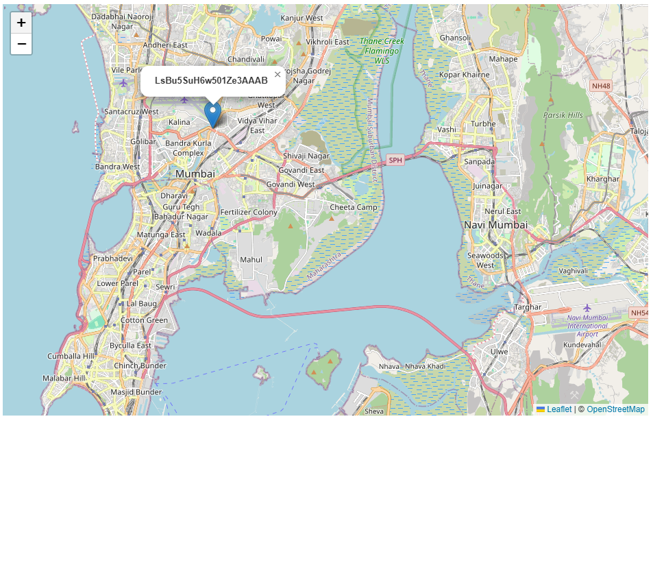

# 🗺️ Live Location Tracker (OIDC + Kafka)

A real-time location tracking system built using:

- **WebSockets (Socket.IO)** → live location updates  
- **Kafka** → event streaming pipeline  
- **OIDC OAuth Service** → authentication  
- **Leaflet.js** → map visualization  



##  Features

- Real-time user location updates  
- Secure login via OIDC OAuth  
- Scalable event processing using Kafka  
- Multi-user tracking on map  


##  Project Structure
```bash
project/
├── src/
│ ├── public/ # Frontend (map + socket client)
│ ├── app.ts # App setup
│ ├── db.ts # Database connection
│ ├── kafka-admin.ts # Topic creation script
│ ├── kafka-client.ts # Kafka configuration
│ ├── model.ts # DB models
│ ├── server.ts # Main server (Express + Socket.IO)
│ ├── token.ts # Token utilities (OIDC)
```

## Setup

### 1. Install dependencies

```bash
npm install
```
### 2. Run kafka container on docker

```bash
docker-compose up -d
```

### 3. Create kafka topic

```bash
node dist/kafka-admin.js
```

### 4. Run the app

```bash
npm run start
```

## Flow
- User hits / → redirected to OIDC login
- After auth → tokens issued
- Frontend sends location via WebSocket
- Server pushes data → Kafka (location-updates)
- Consumer processes and emits updates
- Map updates in real-time

## Tech stack
- Node.js + Express
- Socket.IO
- Kafka (KRaft mode via Docker)
- TypeScript
- Leaflet.js